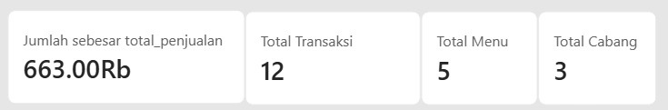
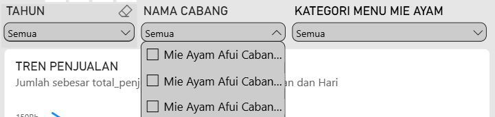
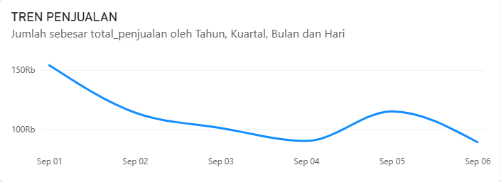
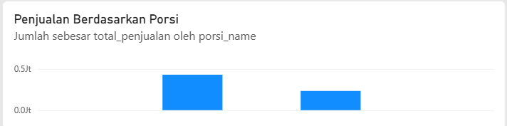
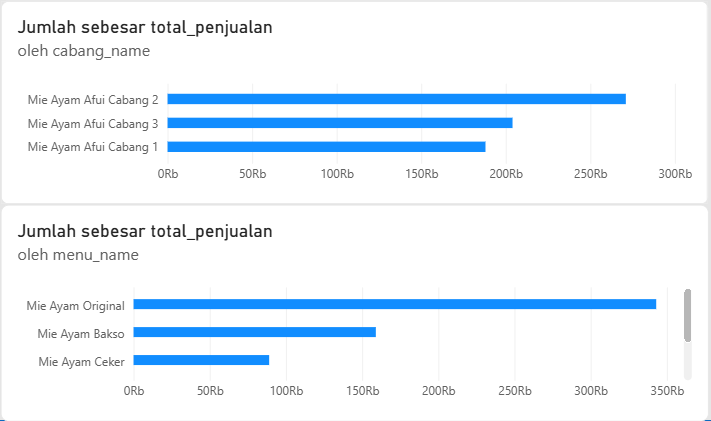
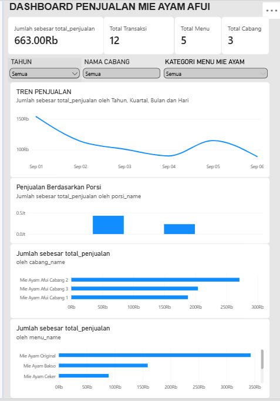

# Lembar Kerja Mahasiswa (LK) — Pertemuan 6

## Tugas 4: Dashboard Design (Wireframe & Prototype)

> **PETUNJUK:** Copy ke `kel-XX/minggu-06/LK.md`. Commit min 10x. Screenshot
> wireframe & prototype. Push sebelum akhir sesi.

## Identitas

| Field    | Isi                           |
| -------- | ----------------------------- |
| Kelas    | SI-C                          |
| Kelompok | 06                            |
| Sub-CPMK | Sub-CPMK03 — Dashboard Design |
| Bobot    | 2% (Tugas 4)                  |

## Aktivitas 1 — Audience-Task-Context (1 paragraf)
- **Audience:**

- **Task:**

- **Context:** 

## Aktivitas 2 — Wireframe lo-fi

> Tempel foto kertas / link Excalidraw / sketsa ASCII. Sebut alasan per visual.

Rancangan Dashboard:
```text
┌─────────────────────────────────────────────────────────────────────┐
│                                                                     │
│                  DASHBOARD PENJUALAN MIE AYAM AFUI                  │
│                                                                     │
├──────────────────┬──────────────────┬──────────────────┬───────────┤
│ TOTAL PENJUALAN  │ TOTAL TRANSAKSI  │ TOTAL MENU       │TOTAL CABANG│
│                  │                  │                  │           │
│   Rp 663.000     │        12        │        5         │     3     │
└──────────────────┴──────────────────┴──────────────────┴───────────┘
┌─────────────────────────────────────────────────────────────────────┐
│                                                                     │
│  TAHUN              NAMA CABANG          KATEGORI MENU              │
│                                                                     │
│  ┌────────────┐     ┌───────────────┐    ┌───────────────────────┐ │
│  │   2026 ▼   │     │    Semua ▼    │    │       Semua ▼         │ │
│  └────────────┘     └───────────────┘    └───────────────────────┘ │
│                                                                     │
└─────────────────────────────────────────────────────────────────────┘
┌─────────────────────────────────────────────────────────────────────┐
│                                                                     │
│                        TREN PENJUALAN                               │
│                                                                     │
│  Menampilkan perubahan total penjualan berdasarkan tanggal.        │
│                                                                     │
│  Rp                                                                 │
│   │ ●                                                               │
│   │   ●                                                             │
│   │     ●                                                           │
│   │       ●                                                         │
│   │          ●────●                                                 │
│   └────────────────────────────────────────────── Tanggal           │
│                                                                     │
│                         Line Chart                                  │
└─────────────────────────────────────────────────────────────────────┘
┌─────────────────────────────────────────────────────────────────────┐
│                                                                     │
│                  PENJUALAN BERDASARKAN PORSI                        │
│                                                                     │
│  Membandingkan total penjualan berdasarkan jenis porsi.            │
│                                                                     │
│  Biasa   ███████████████████                                       │
│  Jumbo   █████████████                                             │
│                                                                     │
│                       Column Chart                                  │
└─────────────────────────────────────────────────────────────────────┘
┌─────────────────────────────────────────────────────────────────────┐
│                                                                     │
│                     PENJUALAN PER CABANG                            │
│                                                                     │
│  Cabang 2  █████████████████████████                               │
│  Cabang 3  ██████████████████████                                  │
│  Cabang 1  ███████████████████                                     │
│                                                                     │
│                         Bar Chart                                   │
└─────────────────────────────────────────────────────────────────────┘
┌─────────────────────────────────────────────────────────────────────┐
│                                                                     │
│                      PENJUALAN PER MENU                             │
│                                                                     │
│  Mie Ayam Original  ███████████████████████                        │
│  Mie Ayam Bakso     ██████████████                                 │
│  Mie Ayam Ceker     ███████                                        │
│  Es Teh             █████                                          │
│  Bakso Kuah         ████                                           │
│                                                                     │
│                          Bar Chart                                  │
└─────────────────────────────────────────────────────────────────────┘
```

**Alasan visual:**


## Aktivitas 3 — Prototype hi-fi Power BI

> Screenshot dashboard (min. 3 visual + 1 slicer). `.pbix` opsional commit.

**Daftar visual:**
- Card — Total Penjualan
  Menampilkan total keseluruhan nilai penjualan dari data transaksi.
- Card — Total Transaksi
  Menampilkan jumlah transaksi yang terdapat pada data.
- Card — Total Menu
  Menampilkan jumlah menu yang tersedia dalam data.
- Card — Total Cabang
  Menampilkan jumlah cabang yang dianalisis.
- Gambar Semua Card :

    


- Slicer — Tahun
  Digunakan untuk memilih tahun yang ingin ditampilkan.
- Slicer — Nama Cabang
  Digunakan untuk memfilter data berdasarkan cabang tertentu.
- Slicer — Kategori Menu
  Digunakan untuk memfilter data berdasarkan kategori menu.
- Gambar Semua Slicer :

    


- Line Chart — Tren Penjualan
  Menampilkan perubahan total penjualan berdasarkan tanggal sehingga pengguna dapat melihat pola naik atau turunnya penjualan.
- Gambar Semua Line Chart :

    


- Column Chart — Penjualan Berdasarkan Porsi
  Menampilkan perbandingan total penjualan berdasarkan jenis porsi.
- Gambar Semua Column Chart :

  


- Bar Chart — Penjualan per Cabang
  Menampilkan perbandingan total penjualan dari setiap cabang.
- Bar Chart — Penjualan per Menu
  Menampilkan perbandingan total penjualan dari setiap menu.
- Gambar Semua Bar Chart :

  


**Screenshot dashboard Power BI:**



## Aktivitas 4 — Peer Review (feedback ke 1 kelompok lain)

- Kelompok yang direview: `<kel-YY>`
- Feedback (clarity / visual / audience-fit): 

## Refleksi


### Refleksi Pribadi Per Anggota :

#### [Isyaka Dhafa Maulana — Ketua]
<Pada LK minggu ini, saya belajar tentang dashboard design, khususnya pada Aktivitas 3 yaitu membuat prototype hi-fi menggunakan Power BI. Saya belajar bagaimana mengubah data yang sebelumnya berbentuk tabel atau database yang cukup sulit dibaca secara langsung menjadi informasi yang lebih sederhana dan mudah dipahami melalui visualisasi. Dalam aktivitas ini, saya membuat Card untuk KPI, Slicer dalam bentuk dropdown, Line Chart untuk tren penjualan, Column Chart untuk penjualan berdasarkan porsi, serta Bar Chart untuk penjualan per cabang dan per menu. 

Dari kegiatan ini, saya memahami bahwa visualisasi data dapat membantu pemilik Mie Ayam Afui melihat informasi penjualan dengan lebih cepat, seperti tren penjualan, perbandingan antar-cabang, dan penjualan setiap menu. Dengan adanya dashboard, data yang sebelumnya sulit dibaca dapat menjadi informasi yang lebih jelas dan berguna bagi pemilik dalam melakukan evaluasi serta mengambil keputusan terkait penjualan.>

#### [Habrian Daffa Dwiyandana - Anggota 2]
<refleksi>

#### [Mohamad Safi'i - Anggota 3]
<refleksi>

#### [Muhammad Irfan Mukasyaf Al Fuady - Anggota 4]
<refleksi>

#### [Embun Bigar Hidayat - Anggota 5]
<refleksi>


### Daftar Kontribusi
| Anggota | Bagian yang Dikerjakan | Persentase Kontribusi |
|---|---|---|
| Isyaka Dhafa Maulana |  | % |
| Habrian Daffa Dwiyandana | | % |
| Mohamad Safi'i |  | % |
| Muhammad Irfan Mukasyaf Al Fuady |  | % |
| Embun Bigar Hidayat |  | % |
| **Total** | | **100%** |

### Checklist
- [ ] ATC tercatat
- [ ] Wireframe + alasan visual
- [ ] Prototype screenshot (>=3 visual + slicer)
- [ ] Peer review ke kelompok lain
- [ ] Refleksi perubahan + refleksi anggota + kontribusi 100%
- [ ] >=10 commit
