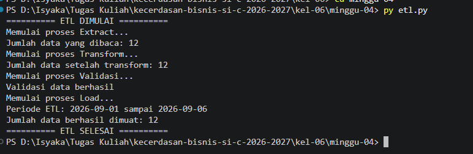
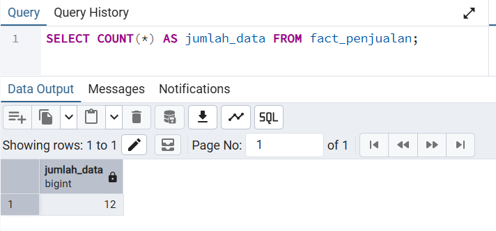
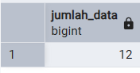
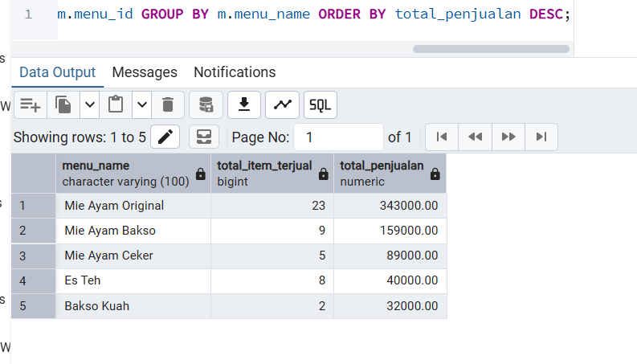

# Lembar Kerja Mahasiswa (LK) — Pertemuan 4
## Tugas 3: ETL Process Design & Implementation

> **PETUNJUK:** Copy ke `kel-XX/minggu-04/LK.md`. Commit bertahap min 10x.
> Sertakan file `etl.py`. Push sebelum akhir sesi. Jangan hapus git history / edit kelompok lain.

## Identitas
| Field | Isi |
|---|---|
| Kelas | SI-C |
| Kelompok | 06 |
| Tanggal | 2026-09-11 |
| Sub-CPMK | Sub-CPMK02 — ETL Process Design |
| Bobot | 3% (Tugas 3) |
| Domain | (lanjutan Tugas 1-2) |

## Aktivitas 1 — Desain ETL
- **Sumber data:** <daftar sumber CSV/Excel/dll>
- **Daftar transform:** <urutan pembersihan/derivasi>
- **Strategi idempotensi:** <delete-then-insert / UPSERT; jelaskan>

## Aktivitas 2 — Data Quality Checks (min 3, sebut dimensinya)
1. <check> — dimensi: <completeness/uniqueness/validity/...>
2. <check> — dimensi: <...>
3. <check> — dimensi: <...>

## Aktivitas 3 — Kode & Bukti
> Tempel `etl.py` (atau commit file terpisah `etl.py` di folder ini). Pastikan jalan.
    

**Bukti jalan (screenshot/teks):**
- `SELECT COUNT(*) FROM fact_penjualan` sebelum & sesudah ETL:
    Sebelum :

    Sesudah :

Jumlah data sebelum dan setelah ETL tetap sama, yaitu 12 data, karena data transaksi pada periode tersebut sebelumnya sudah diinputkan pada LK-03. Pada proses ETL, data pada periode yang sama dihapus terlebih dahulu menggunakan strategi delete-then-insert, kemudian dimuat kembali berdasarkan data dari file CSV. Oleh karena itu, jumlah baris tetap 12, tetapi proses ETL tetap berhasil melakukan pemuatan ulang data tanpa menghasilkan duplikasi.

- 1 query agregasi (mis. revenue per menu) setelah ETL:

- `SELECT m.menu_name, SUM(f.jumlah_terjual) AS total_item_terjual, SUM(f.total_penjualan) AS total_penjualan FROM fact_penjualan f JOIN dim_menu m ON f.menu_id = m.menu_id GROUP BY m.menu_name ORDER BY total_penjualan DESC;`

    

## Aktivitas 4 — Keputusan Desain (min 2)
| Keputusan | Pilihan | Alasan |
|---|---|---|
| <mis. bulk vs loop insert> | | |
| <mis. UPSERT vs delete-insert fact> | | |

## Refleksi Pribadi Per Anggota
> Wajib masing-masing anggota (1-2 paragraf). 

### [Isyaka Dhafa Maulana — Ketua]
<refleksi>

### [Habrian Daffa Dwiyandana - Anggota 2]
<refleksi>

### [Mohamad Safi'i - Anggota 3]
<refleksi>

### [Muhammad Irfan Mukasyaf Al Fuady - Anggota 4]
<refleksi>

### [Embun Bigar Hidayat - Anggota 5]
<refleksi>

## Daftar Kontribusi
| Anggota | Bagian yang Dikerjakan | Persentase Kontribusi |
|---|---|---|
| Isyaka Dhafa Maulana |  |  % |
| Habrian Daffa Dwiyandana | |  % |
| Mohamad Safi'i |  |  % |
| Muhammad Irfan Mukasyaf Al Fuady |  |  % |
| Embun Bigar Hidayat |  |  % |
| **Total** | | **100%** |

## Checklist
- [ ] Desain ETL + idempotensi tercatat
- [ ] >=3 quality check + dimensi
- [ ] etl.py jalan + bukti COUNT + query agregasi
- [ ] >=2 keputusan desain
- [ ] Refleksi semua anggota + kontribusi 100%
- [ ] >=10 commit deskriptif + push
